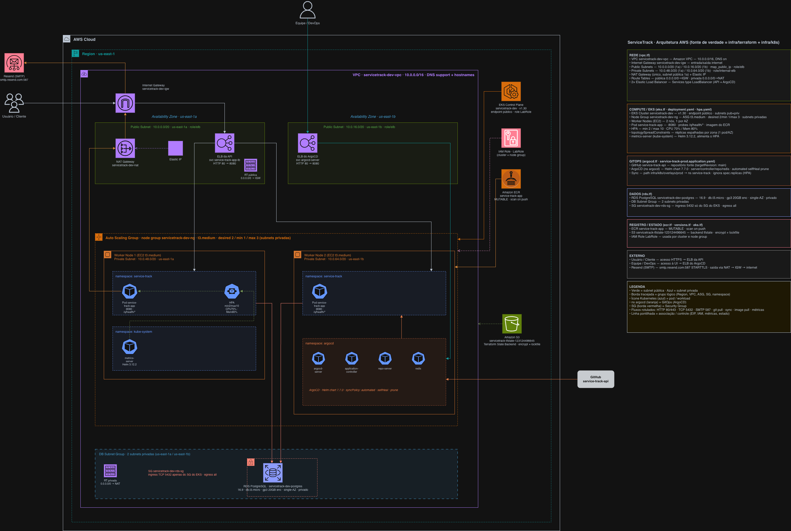
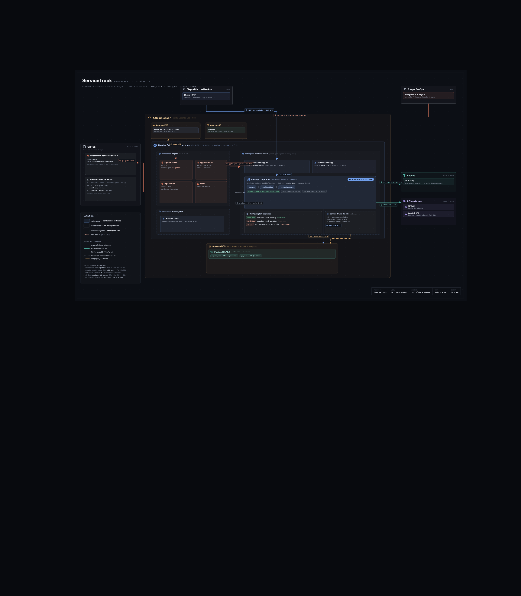
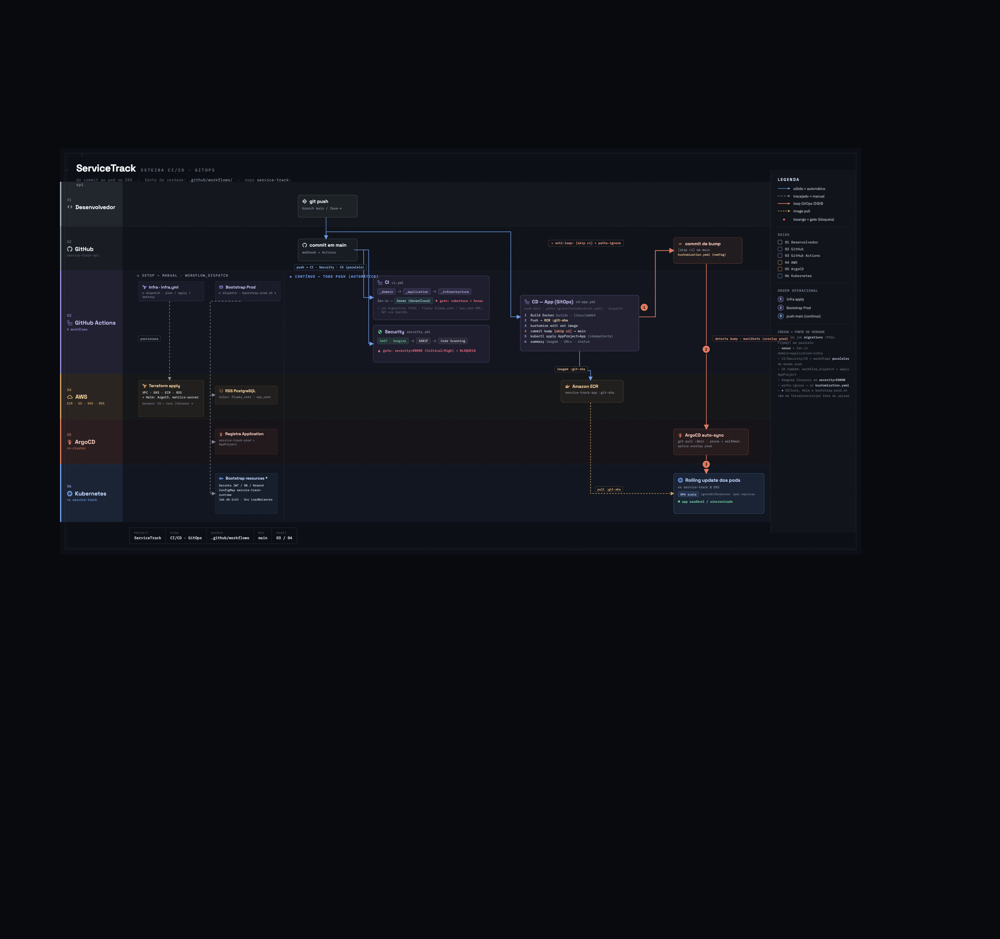

# ServiceTrack API

Backend para gestão de ordens de serviço de oficinas mecânicas. Responsável por controlar todo o ciclo de vida de uma OS — da abertura ao diagnóstico, orçamento, execução e entrega — com rastreabilidade completa por auditoria.

---

## Contexto de negócio

Uma oficina mecânica precisa registrar e acompanhar cada atendimento. O sistema suporta:

- Abertura de OS por cliente (dados de cliente e veículo) — nasce em `RECEBIDA`
- Abertura completa de OS pelo mecânico (já com serviços e insumos diagnosticados) — nasce em `EM_DIAGNOSTICO`
- Diagnóstico pelo mecânico (associação de serviços e insumos)
- Geração de orçamento com custo de mão de obra e insumos
- Aprovação ou reprovação do orçamento pelo cliente (no app ou por link/botão no e-mail — magic link)
- Execução dos serviços com registro por mecânico responsável
- Finalização e entrega do veículo

### Abertura de OS: dois caminhos

| Rota | Ator | Payload | Status inicial |
|---|---|---|---|
| `POST /ordem-servico` | Cliente (ou mecânico) | motivo, cliente, mecânico, veículo | `RECEBIDA` |
| `POST /ordem-servico/completa` | Mecânico | motivo, cliente, veículo, **serviços + insumos** | `EM_DIAGNOSTICO` |

O cliente não conhece serviços e peças ao abrir a OS — quem diagnostica é o mecânico. Por isso a
abertura completa é exclusiva do mecânico: ele abre a OS já com os itens diagnosticados, o mecânico
vinculado é o próprio solicitante autenticado e a OS entra direto em diagnóstico, pronta para a
geração do orçamento (`POST /ordem-servico/{id}/orcamento`).

---

## Stack tecnológica

| Camada | Tecnologia |
|---|---|
| Linguagem | Kotlin 2.0.21 + JVM 21 |
| Framework | Quarkus 3.15.1 |
| Persistência (prod) | PostgreSQL 16 |
| Persistência (dev/test) | H2 in-memory |
| ORM | Hibernate ORM (via Quarkus) |
| Autenticação | JWT RS256 (SmallRye JWT) |
| Criptografia de senha | BCrypt |
| Build | Gradle Kotlin DSL (multi-module) |
| Containers | Docker + Docker Compose |
| Orquestração (prod) | Kubernetes — Amazon EKS 1.30, multi-AZ + HPA |
| IaC | Terraform (VPC, EKS, ECR, RDS, ArgoCD) — state em S3 |
| CD / GitOps | ArgoCD (auto-sync, self-heal) + GitHub Actions |
| Qualidade | JaCoCo + SonarCloud |
| Segurança (SAST) | Semgrep |
| CI | GitHub Actions |

---

## Arquitetura

O projeto é um **monólito modular** estruturado em três módulos Gradle alinhados com Hexagonal Architecture e DDD:

```
_domain          ← regras de negócio puras (sem dependência de framework)
_application     ← orquestração de casos de uso, ports, DTOs, services
_infrastructure  ← REST, persistência, JWT, interceptors, adapters
```

A regra de dependência segue a direção:

```
infrastructure → application → domain
```

`_domain` não conhece `_application` nem `_infrastructure`. `_application` não conhece `_infrastructure`. A inversão de dependência é feita via interfaces (ports) definidas em `_application` e implementadas em `_infrastructure`.

Para detalhes de cada camada, veja:
- [_domain/README.md](software/service-track-api/_domain/README.md)
- [_application/README.md](software/service-track-api/_application/README.md)
- [_infrastructure/README.md](software/service-track-api/_infrastructure/README.md)

---

## Principais decisões arquiteturais

| ADR | Decisão | Razão resumida |
|---|---|---|
| [ADR-001](docs/adr/ADR-001-monolito-modular.md) | Monólito Modular | Menor complexidade operacional no MVP |
| [ADR-002](docs/adr/ADR-002-postgresql.md) | PostgreSQL | Banco relacional robusto para dados transacionais |
| [ADR-003](docs/adr/ADR-003-kotlin.md) | Kotlin | Expressividade, null safety, value classes |
| [ADR-004](docs/adr/ADR-004-quarkus.md) | Quarkus | Startup rápido, suporte nativo a CDI/MicroProfile |
| [ADR-005](docs/adr/ADR-005-autenticacao-jwt.md) | JWT RS256 | Stateless, integrado via SmallRye JWT |
| [ADR-015](docs/adr/ADR-015-kubernetes-eks.md) | Kubernetes no EKS | HPA, multi-AZ, alta disponibilidade |
| [ADR-016](docs/adr/ADR-016-terraform-iac.md) | Terraform (IaC) | Ambiente reproduzível: VPC, EKS, ECR, RDS, ArgoCD |
| [ADR-017](docs/adr/ADR-017-gitops-argocd.md) | GitOps com ArgoCD | Git como fonte de verdade, auto-sync e self-heal |
| [ADR-018](docs/adr/ADR-018-bootstrap-scripts-operacionais.md) | Bootstrap de segredos | Segredos/config dinâmica fora do Git, idempotente |

---

## Como rodar o projeto

### Pré-requisitos

| Ferramenta | Versão mínima | Observação |
|---|---|---|
| Docker Engine / Docker Desktop | 24+ | BuildKit habilitado por padrão |
| Docker Compose | v2 (`docker compose`) | Integrado ao Docker Desktop |

> **Apple Silicon (M1/M2/M3):** o build é nativo em ARM64. Para gerar uma imagem compatível com servidores Linux AMD64, use `docker buildx build --platform linux/amd64 -t servicetrack-api .` antes do `docker compose up`.

### Variáveis de ambiente

```bash
cd software/service-track-api
cp .env.example .env
```

Edite `.env` com os valores desejados. O arquivo **nunca deve ser commitado** (já coberto pelo `.gitignore`).

As chaves JWT devem estar em `_infrastructure/src/main/resources/keys/`:

```bash
openssl genrsa -out privateKey.pem 4096
openssl rsa -in privateKey.pem -pubout -out publicKey.pem
```

### Subindo com Docker Compose

```bash
cd software/service-track-api
docker compose up --build
```

O Compose aguarda o Postgres passar no healthcheck antes de iniciar a API — a primeira subida pode levar alguns segundos extras.

| Serviço | URL |
|---|---|
| API | `http://localhost:8080` |
| PostgreSQL | `localhost:5432` |
| Swagger UI | `http://localhost:8080/q/swagger-ui` |

#### Rebuild sem cache (quando necessário)

```bash
docker compose build --no-cache
docker compose up
```

### Modo dev (H2 in-memory)

```bash
cd software/service-track-api
./gradlew :_infrastructure:quarkusDev
```

Console H2 disponível em `http://localhost:8080/h2-console`.

> **Windows:** certifique-se de usar o terminal WSL2 ou Git Bash. O `gradlew` requer line endings LF — o `.gitattributes` na raiz garante isso automaticamente ao clonar.

---

## Como rodar os testes

```bash
cd software/service-track-api

# Testes unitários de domínio (sem framework)
./gradlew :_domain:test

# Testes unitários de application (MockK)
./gradlew :_application:test

# Testes de integração (QuarkusTest + H2) — exige chaves JWT em _infrastructure/src/test/resources/keys/
./gradlew :_infrastructure:test
```

Geração de relatórios JaCoCo por módulo:

```bash
./gradlew :_domain:jacocoTestReport
./gradlew :_application:jacocoTestReport
./gradlew :_infrastructure:jacocoTestReport
# Saída: <módulo>/build/reports/jacoco/test/jacocoTestReport.xml
```

---

## OpenAPI / Swagger UI

O projeto adota abordagem **contract-first**. Os contratos estão em `software/service-track-api/openApi/`.

Com a aplicação rodando:

```
http://localhost:8080/q/swagger-ui
```

---

## Estrutura de pastas

```
ServiceTrack-API/
├── .github/workflows/     # ci, security, cd-app (GitOps), infra (Terraform), bootstrap-prod
├── docs/
│   ├── adr/               # Architecture Decision Records (001–018)
│   ├── rfc/               # Request for Comments (001–018)
│   ├── c4/                # Diagramas C4 (context, container, components, code)
│   ├── mvp-1/ mvp-2/      # Enunciados e DDD (Domain Storytelling, Event Storming)
│   └── srs.md             # Software Requirements Specification
├── infra/
│   ├── terraform/         # IaC: VPC, EKS, ECR, RDS, ArgoCD, metrics-server
│   ├── k8s/               # base/ + overlays/{local,prod} (Kustomize) + db-init-job
│   ├── argocd/            # bootstrap, AppProject, Applications (local e prod)
│   ├── kind/              # cluster local de validação
│   ├── GITOPS_AWS.md      # runbook de produção (EKS + ArgoCD)
│   └── GITOPS_LOCAL.md    # runbook local (kind + ArgoCD)
├── scripts/               # bootstrap-prod, tf, db-seed, demo-hpa, aws-student-login
└── software/
    └── service-track-api/
        ├── _domain/       # Regras de negócio puras
        ├── _application/  # Casos de uso, ports, DTOs
        ├── _infrastructure/ # REST, persistência, JWT, adapters
        ├── openApi/       # Especificações OpenAPI (contract-first)
        ├── docker-compose.yaml
        ├── Dockerfile
        └── build.gradle.kts
```

---

## CI

Pipeline em `.github/workflows/ci.yml`. Executa em pushes para `main`, `develop` e `fase-*`.

**Jobs (encadeados):**

| Job | O que faz |
|---|---|
| Domain Coverage | `./gradlew :_domain:test :_domain:jacocoTestReport` |
| Application Coverage | `./gradlew :_application:test :_application:jacocoTestReport` |
| Infrastructure Coverage | Gera chaves JWT temporárias via OpenSSL, executa `./gradlew :_infrastructure:test :_infrastructure:jacocoTestReport` |
| Sonar Analysis | Agrega os três relatórios e envia para SonarCloud |

---

## Segurança

Pipeline em `.github/workflows/security.yml`. Executa nos mesmos branches do CI.

**SAST com Semgrep:**
- Analisa todo o código com regras `auto`
- Gera relatórios JSON e SARIF
- **Bloqueia o pipeline** se houver findings Critical/High
- SARIF enviado ao GitHub Code Scanning (Security tab)

---

## Fase 2 — Infraestrutura, Deploy e GitOps

Evolução da Fase 1 para atender escalabilidade dinâmica, alta disponibilidade e deploy
automatizado ([enunciado](docs/mvp-2/CASE.md)). Decisões completas em
[ADR-015](docs/adr/ADR-015-kubernetes-eks.md) (EKS), [ADR-016](docs/adr/ADR-016-terraform-iac.md)
(Terraform), [ADR-017](docs/adr/ADR-017-gitops-argocd.md) (ArgoCD) e
[ADR-018](docs/adr/ADR-018-bootstrap-scripts-operacionais.md) (bootstrap/scripts).

### Descrição da solução e objetivos

Com o aumento de demanda e a expansão para novas unidades, a oficina precisava de um ambiente
resiliente e elástico. Esta fase evolui a API da Fase 1 sem alterar o domínio, focando em
**infraestrutura, automação e escalabilidade**:

- **Escalabilidade dinâmica** — HPA escala a aplicação de 2 a 10 réplicas conforme CPU/memória,
  suportando picos de ordens de serviço sem intervenção manual.
- **Alta disponibilidade** — cluster EKS multi-AZ (2 zonas), réplicas espalhadas por AZ e RDS
  gerenciado; a queda de uma zona não derruba o serviço.
- **Provisionamento automatizado** — toda a infraestrutura é descrita em Terraform (IaC),
  reproduzível e versionada.
- **Deploy automatizado (GitOps)** — o Git é a fonte da verdade; ArgoCD sincroniza o cluster a
  cada commit, com rolling update e self-heal.
- **Qualidade sustentável** — arquitetura hexagonal, testes automatizados (unitários e de
  integração), cobertura no SonarCloud e SAST com Semgrep na esteira.

### Desenho da arquitetura proposta

**Componentes da aplicação** — monólito modular em Kotlin/Quarkus, três módulos Gradle alinhados
à Arquitetura Hexagonal (`_domain → _application → _infrastructure`, ver
[Arquitetura](#arquitetura)). Exposta via REST (contract-first OpenAPI), autenticação JWT RS256,
persistência em PostgreSQL e notificações por e-mail (Resend). Diagramas C4 em
[docs/c4/](docs/c4/) (contexto, container e componentes por módulo).

**Infraestrutura provisionada** — VPC multi-AZ na AWS, cluster EKS com a aplicação em pods
gerenciados por HPA, RDS PostgreSQL privado, imagens no ECR e ArgoCD no cluster.



**Deployment (C4)** — distribuição dos artefatos em execução no cluster.



**Fluxo de deploy (esteira CI/CD + GitOps)**



### Componentes da infraestrutura

| Componente | Detalhe |
|---|---|
| VPC | `10.0.0.0/16`, 2 AZs (us-east-1a/b), subnets públicas + privadas, NAT único |
| EKS 1.30 | node group `t3.medium` (2 nós, um por AZ) com `LabRole` |
| Aplicação | Deployment `service-track-app` (2–10 réplicas via **HPA** CPU 70%/mem 80%), probes `/q/health/*`, réplicas espalhadas por AZ |
| Banco | RDS PostgreSQL 16 privado (acesso só do SG do cluster), roles `flyway_user`/`app_user` |
| Registro | ECR `service-track-app` (tag = git-sha, scan on push) |
| GitOps | ArgoCD (chart 7.7.0 via Terraform/Helm), auto-sync + self-heal do overlay `prod` |
| Métricas | metrics-server (requisito do HPA) |

### Fluxo de deploy (GitOps)

```
push na main ──► CD (cd-app.yml): build ──► push ECR ──► bump da tag no overlay (commit [skip ci])
                                                                    │
                                                                    ▼
                                          ArgoCD (in-cluster) detecta o commit e sincroniza
                                                                    │
                                                                    ▼
                                    EKS: rolling update · HPA mantém 2–10 réplicas por carga
```

Pipelines: `infra.yml` (Terraform plan/apply/destroy — manual), `bootstrap-prod.yml`
(segredos + roles no RDS + registro no ArgoCD — manual, 1x após o apply) e `cd-app.yml`
(contínuo). Ordem da primeira subida: **Infra → Bootstrap → push/CD**.

### Instruções de execução

Resumo por cenário; os runbooks completos trazem pré-requisitos e troubleshooting.

| Cenário | Guia |
|---|---|
| Execução local (docker-compose ou quarkusDev) | [Como rodar o projeto](#como-rodar-o-projeto) |
| Kubernetes local (kind + ArgoCD) | [infra/GITOPS_LOCAL.md](infra/GITOPS_LOCAL.md) |
| Provisionamento AWS + deploy em produção | [infra/GITOPS_AWS.md](infra/GITOPS_AWS.md) |
| Demonstração de escalabilidade (HPA) | `scripts/demo-hpa.sh` (carga autenticada + `watch kubectl get hpa,pods`) |

#### 1. Execução local

Ver [Como rodar o projeto](#como-rodar-o-projeto): `docker compose up --build` (com Postgres) ou
`./gradlew :_infrastructure:quarkusDev` (H2 in-memory). Swagger em `http://localhost:8080/q/swagger-ui`.

#### 2. Provisionamento da infraestrutura com Terraform

Provisiona VPC, EKS, RDS, ECR e ArgoCD. State remoto em S3. Requer AWS CLI autenticada
(`scripts/aws-student-login.sh`). Detalhes em [infra/GITOPS_AWS.md](infra/GITOPS_AWS.md).

```bash
# scripts/tf.sh encapsula `terraform -chdir=infra/terraform` com o profile aws-student
./scripts/tf.sh init
./scripts/tf.sh plan
./scripts/tf.sh apply        # cria toda a infra (~15 min p/ o EKS)

# destruir o ambiente
./scripts/tf.sh destroy
```

Recursos criados (documentados em `infra/terraform/*.tf`): `vpc.tf`, `eks.tf`, `rds.tf`,
`ecr.tf`, `argocd.tf`. Variáveis em `variables.tf` (exemplo em `terraform.tfvars.example`).

#### 3. Deploy em Kubernetes

Manifestos em `infra/k8s/` (Kustomize: `base/` + `overlays/{local,prod}`). Em produção o deploy
é **contínuo via GitOps** — não se aplica YAML na mão; o ArgoCD sincroniza o overlay `prod`.
**Ordem da primeira subida: Infra → Bootstrap → CD.**

```bash
# ordem obrigatoria na primeira subida:
# 1) Infra (acima)   2) Bootstrap   3) CD (push na main)

# 2) Bootstrap (1x): cria Secrets, ConfigMaps, roles no RDS e registra o app no ArgoCD
#    via Actions → "Bootstrap Prod" → Run workflow, ou localmente:
./scripts/bootstrap-prod.sh

# 3) Deploy contínuo: qualquer push na main dispara cd-app.yml (build → ECR → bump → ArgoCD)

# inspecionar o cluster:
kubectl -n service-track get deploy,pods,svc,hpa
kubectl -n argocd get application service-track-prod

# render local dos manifestos (sem aplicar), para revisão:
kubectl kustomize infra/k8s/overlays/prod
```

> Sem o Bootstrap os pods não sobem (faltam os Secrets/ConfigMap de runtime e as roles do RDS).

#### Demonstração de escalabilidade (HPA)

```bash
# terminal A — acompanha o scale em tempo real
watch -n2 'kubectl -n service-track get hpa,pods'

# terminal B — gera carga autenticada (usa `hey` por baixo)
API_URL="http://<elb-da-api>" EMAIL="<email>" SENHA="<senha>" ./scripts/demo-hpa.sh 180 60
```

### Diagramas

Artefatos renderizados em [docs/infra/](docs/infra/): infraestrutura AWS
(`aws-infra.drawio.png`), deployment C4 (`deployment.png`) e esteira CI/CD (`ci-cd.png`).
Diagramas C4 da aplicação (contexto/container/componentes) em [docs/c4/](docs/c4/).
Prompts versionados para regeneração dos desenhos:
[infraestrutura AWS](infra/PROMPT_DIAGRAMA_INFRAESTRUTURA.md) ·
[deployment C4](infra/PROMPT_DIAGRAMA_DEPLOYMENT.md) ·
[esteira CI/CD](infra/PROMPT_DIAGRAMA_ESTEIRA.md).

### Entregáveis

- **Collection completa das APIs (Postman):**
  [service-track.postman_collection.json](software/service-track-api/service-track.postman_collection.json)
  — importar no Postman; inclui todo o fluxo da OS, scripts de autenticação e variáveis com defaults.
  Alternativa viva: **Swagger UI** em `http://<elb-da-api>/q/swagger-ui` (local:
  `http://localhost:8080/q/swagger-ui`). Contratos OpenAPI versionados em
  `software/service-track-api/openApi/`.
- **Vídeo demonstrativo (≤15 min):** https://www.youtube.com/watch?v=EXMPSr7ylxg
  — demonstra deploy, execução do CI/CD, consumo das APIs e escalabilidade automática (HPA).

---

## Cobertura de código

Medida por módulo com JaCoCo e consolidada no SonarCloud. Exclusões: DTOs, entities JPA, classes de configuração e código gerado pelo OpenAPI Generator.

---

## Roadmap / Evoluções futuras

| Item | Status |
|---|---|
| Infraestrutura como código (Terraform) | **Implementado** — [ADR-016](docs/adr/ADR-016-terraform-iac.md), `infra/terraform/` |
| Kubernetes (EKS) + HPA multi-AZ | **Implementado** — [ADR-015](docs/adr/ADR-015-kubernetes-eks.md), `infra/k8s/` |
| Pipeline de CD / deploy automatizado (GitOps) | **Implementado** — [ADR-017](docs/adr/ADR-017-gitops-argocd.md), [GITOPS_AWS.md](infra/GITOPS_AWS.md) |
| Notificações ao cliente (e-mail) | **Implementado** — [ADR-009](docs/adr/ADR-009-notificacoes-email.md), [ADR-014](docs/adr/ADR-014-aprovacao-orcamento-magic-link.md) |
| External Secrets / Sealed Secrets | Possível evolução ([ADR-018](docs/adr/ADR-018-bootstrap-scripts-operacionais.md)) |
| Cluster Autoscaler / Karpenter | Possível evolução |
| Migração para microsserviços | Possível evolução pós-validação do monólito |
